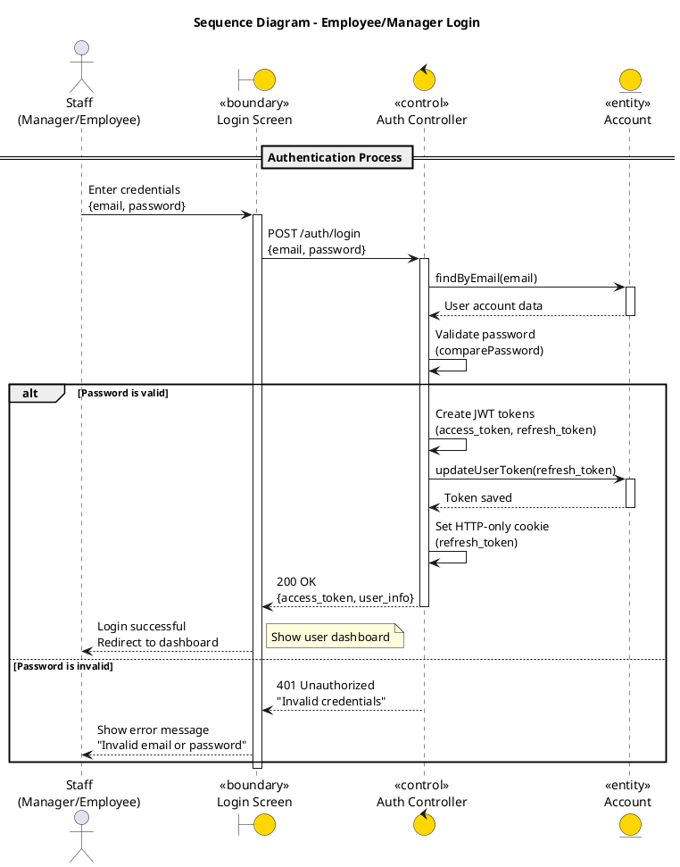
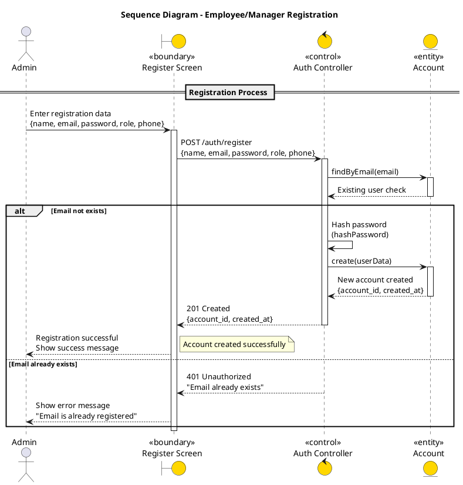
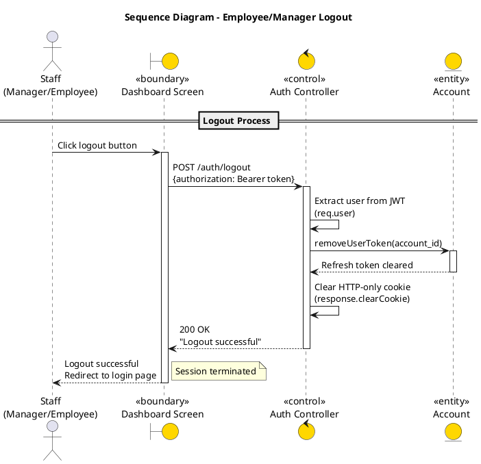
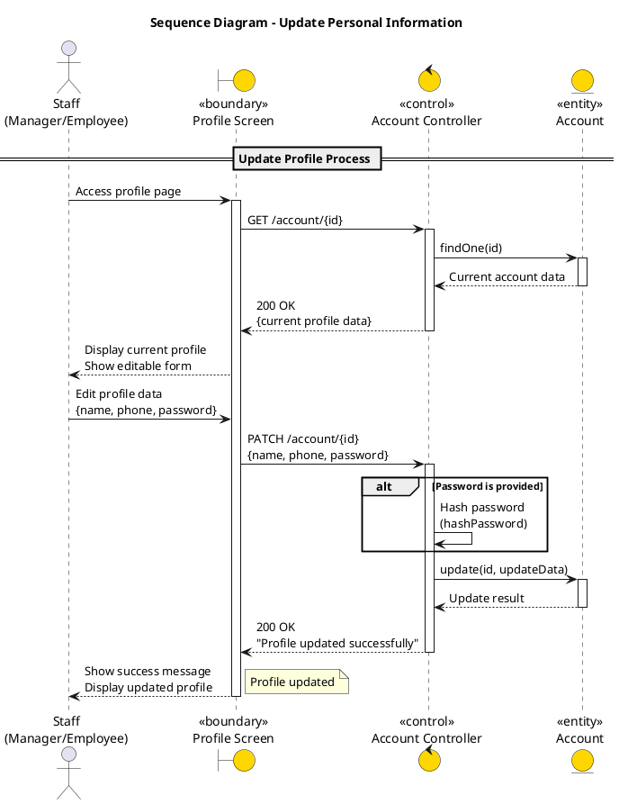

tổng hợp các đoạn code plantuml để vẽ sơ đồ trình tự cho 24 usecases của hệ thống quản lý bán hàng

Mỗi đoạn code sẽ mô tả một usecase cụ thể:

1. usecase: đăng nhập hệ thống dành cho nhân viên và quản lý (Manager, Employee):

2. usecase: đăng ký hệ thống dành cho nhân viên và quản lý (Manager, Employee):

3. usecase: đăng xuất hệ thống dành cho nhân viên và quản lý (Manager, Employee):

4. usecase: Cập nhật thông tin cá nhân dành cho nhân viên và quản lý (Manager, Employee):

5. usecase: quản lý danh sách bàn (xem, thêm, sửa, xóa):