8. usecase: Nhận xử lý đơn hàng dành cho nhân viên (Manager, Employee):

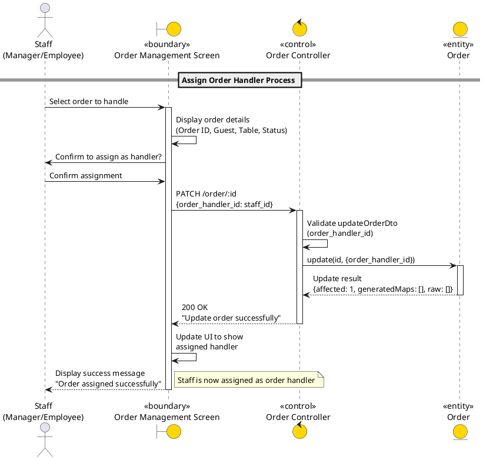

9. usecase: Xem chi tiết đơn hàng dành cho nhân viên (Manager, Employee):

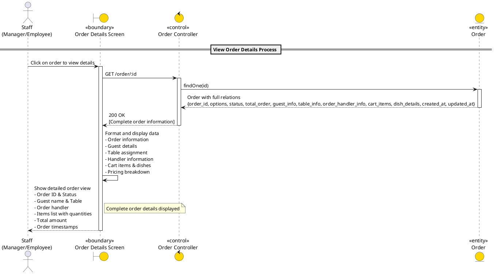

10. usecase: Thêm mới bàn ăn dành cho nhân viên (Manager, Employee):

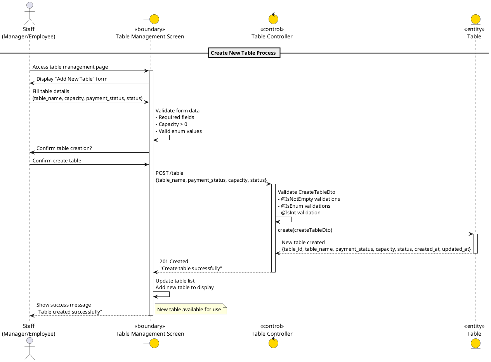

11. usecase: xem danh sach bàn ăn dành cho nhân viên (Manager, Employee):

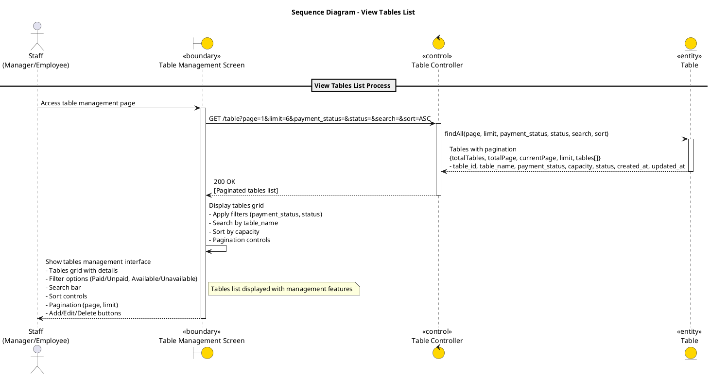

12. usecase: Cập nhật thông tin bàn ăn dành cho nhân viên (Manager, Employee):

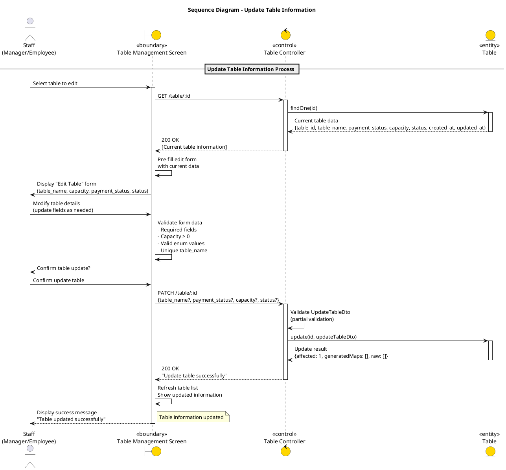

13. usecase: xóa bàn ăn dành cho nhân viên (Manager, Employee):

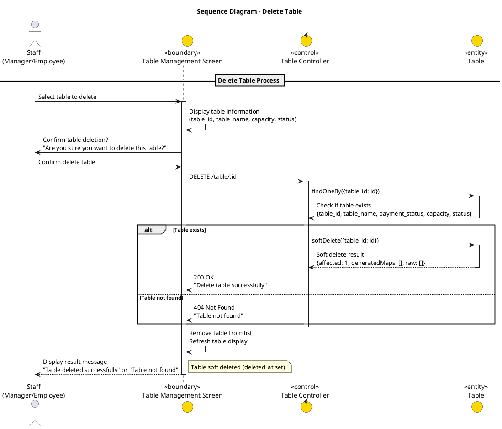

14. usecase: Thêm mới món ăn dành cho nhân viên (Manager, Employee):

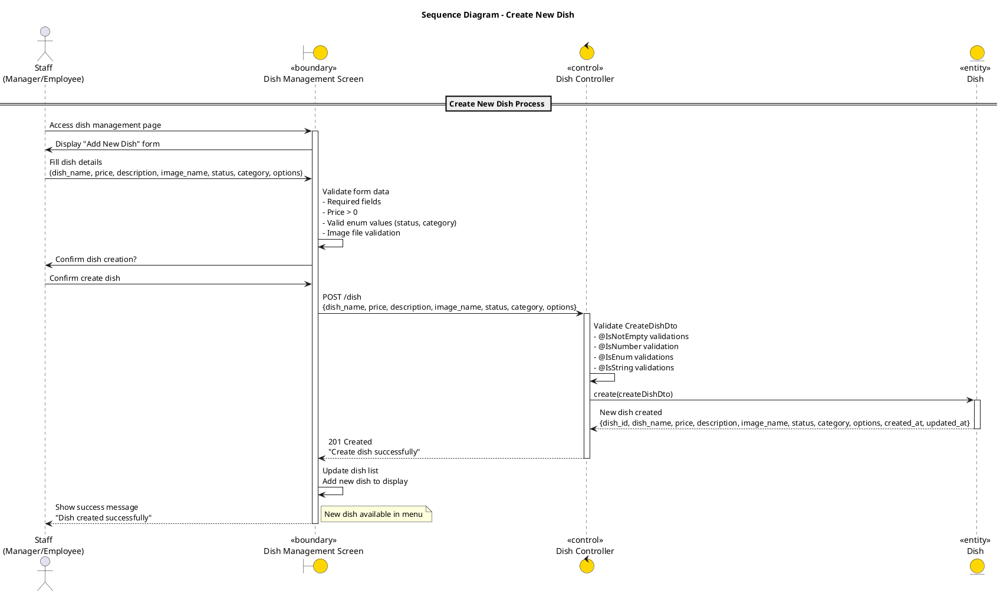

15. usecase: Xem danh sách món ăn dành cho nhân viên (Manager, Employee):

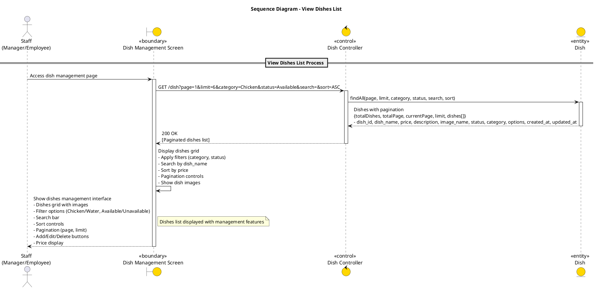

16. usecase: Cập nhật thông tin món ăn dành cho nhân viên (Manager, Employee):

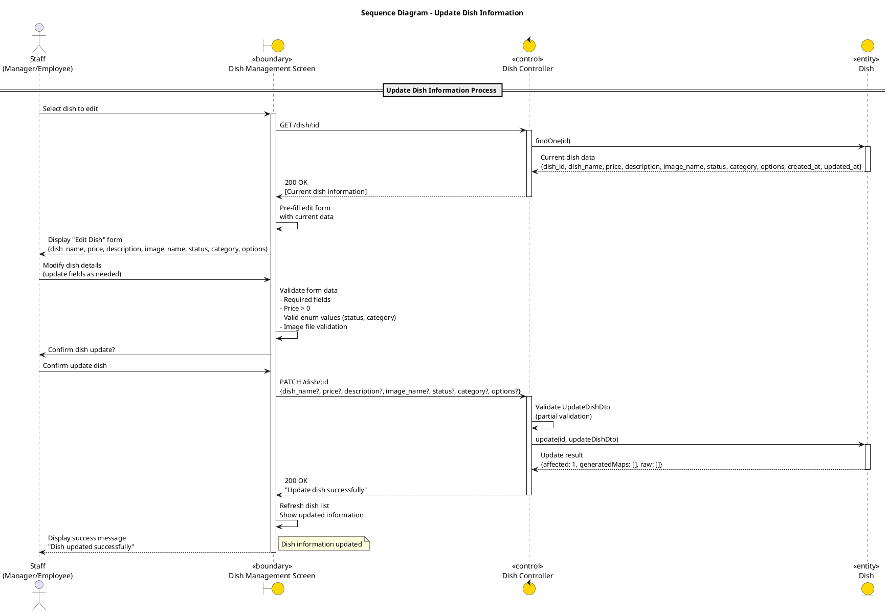

17. usecase: Xóa món ăn dành cho nhân viên (Manager, Employee):

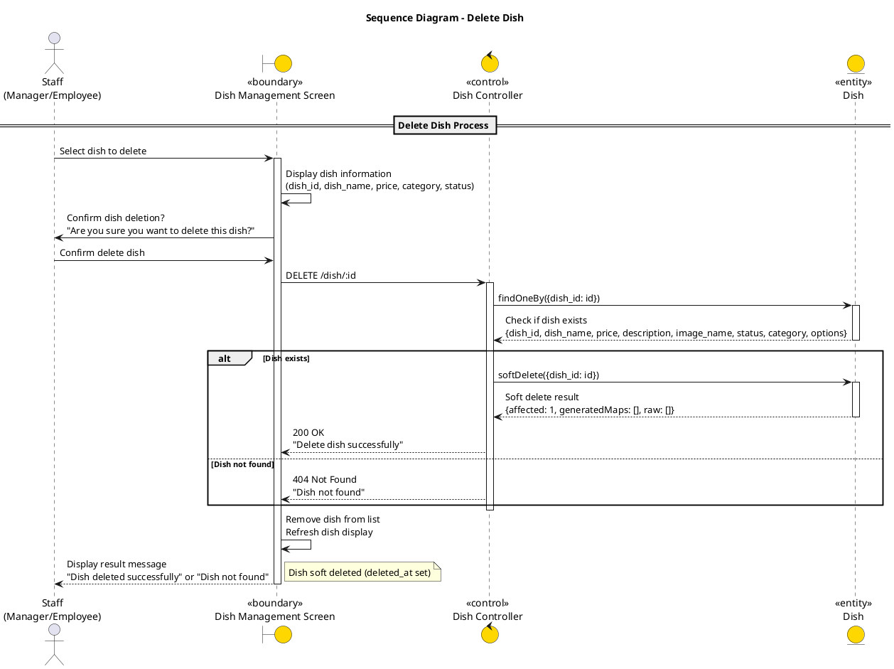

18. usecase: xem danh sách nhân viên chỉ dành cho quản lý (Manager):

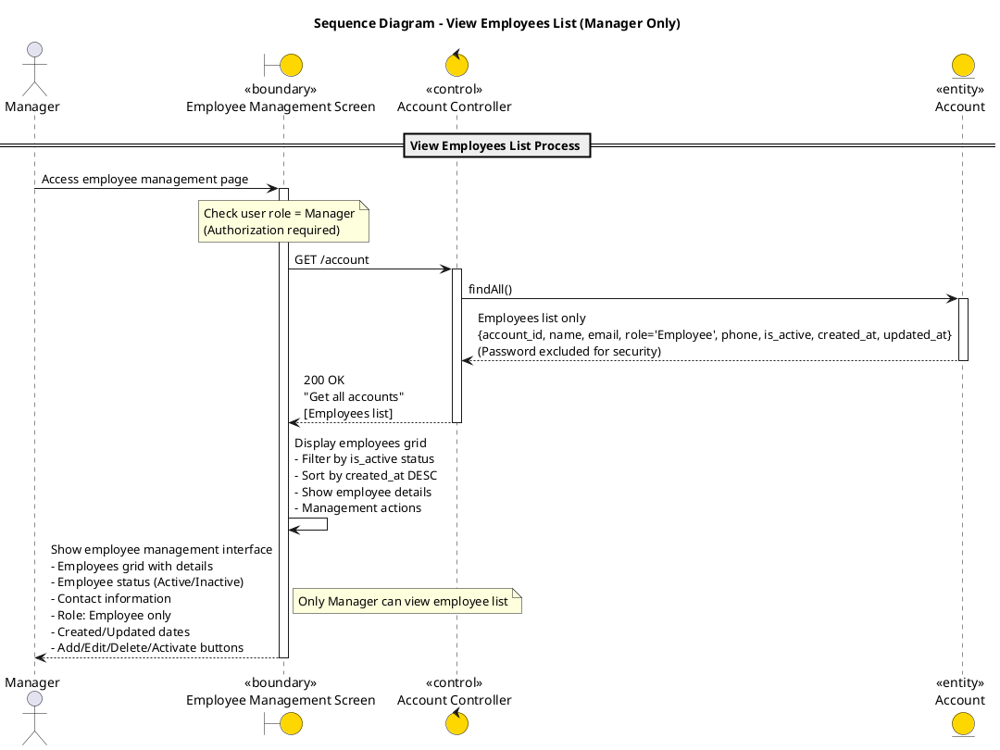

19. usecase: xóa nhân viên chỉ dành cho quản lý (Manager):

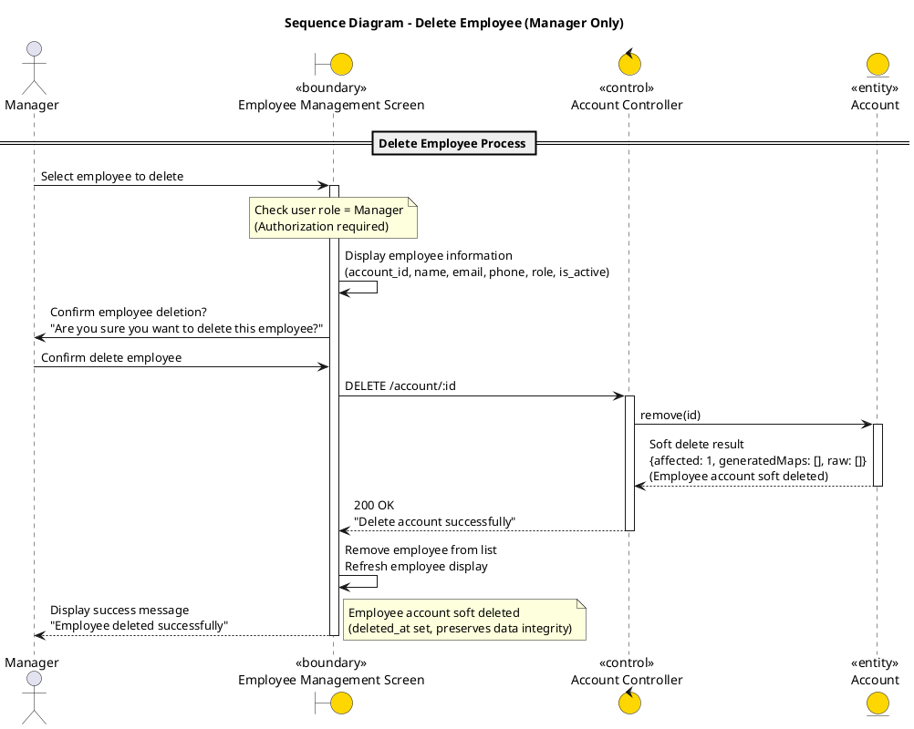