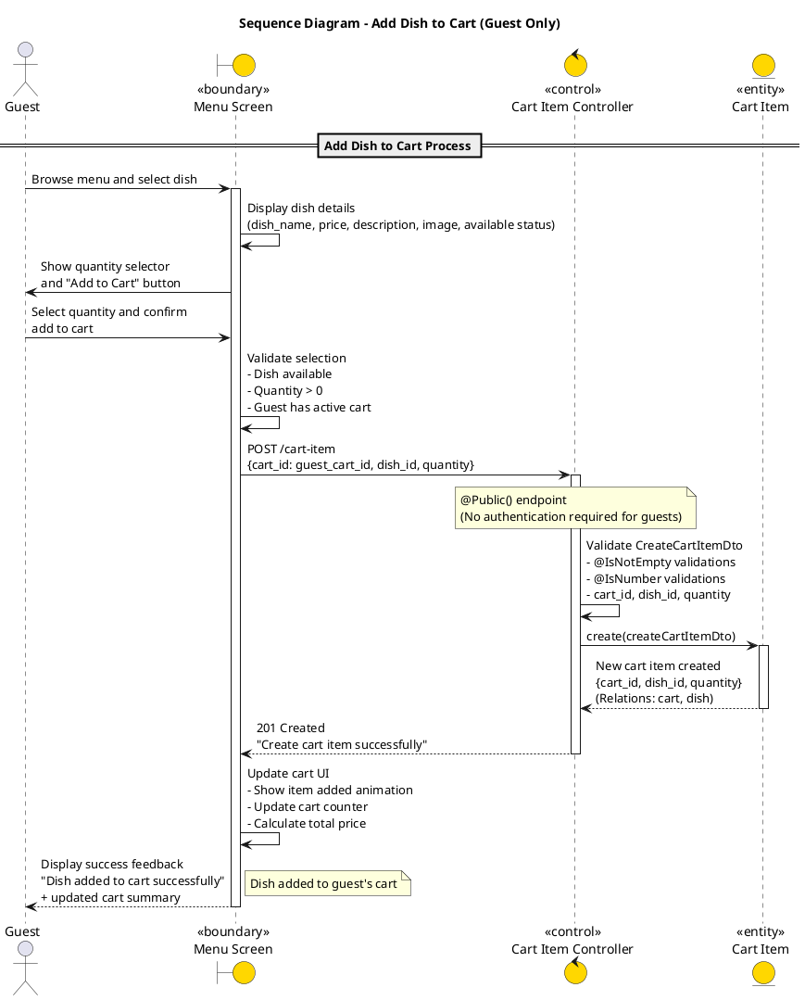
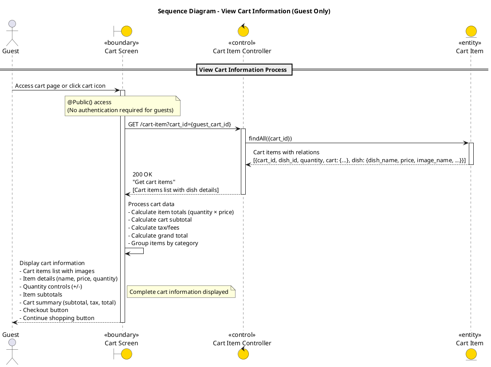
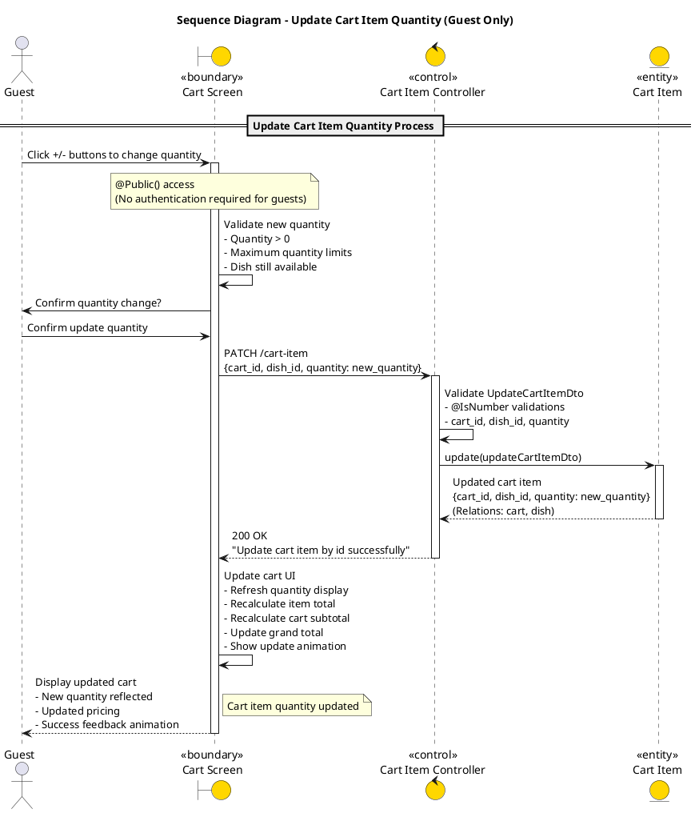
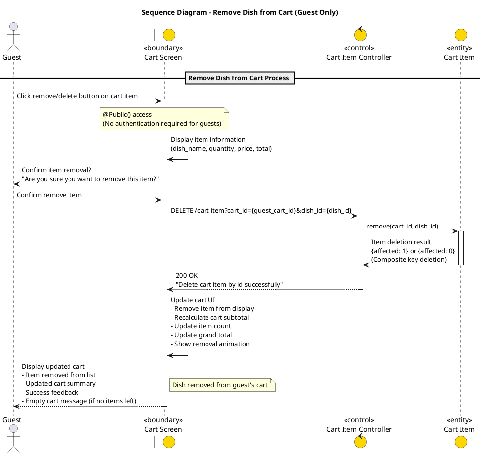
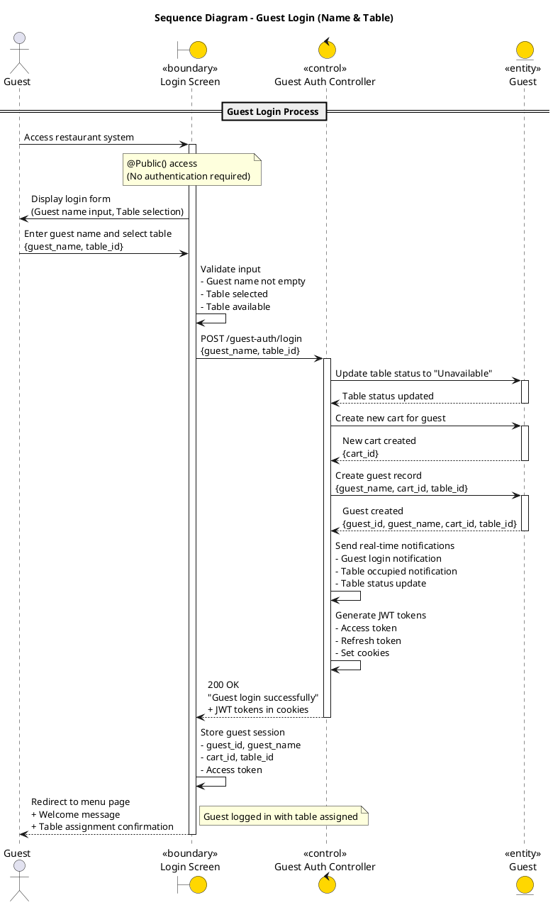
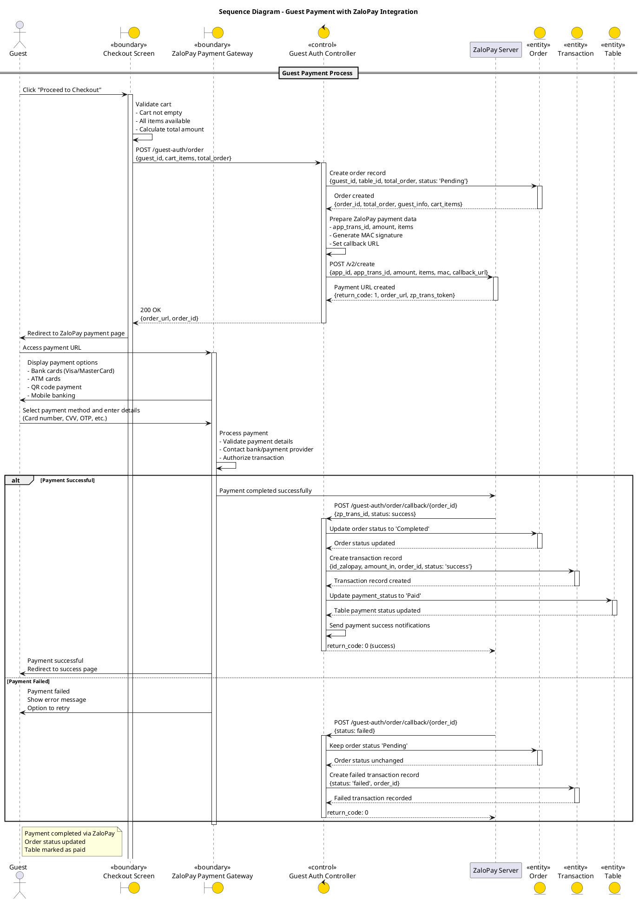

20. usecase: thêm món ăn vào giỏ hàng chỉ dành cho khách hàng (Guest):

21. usecase: xem thông tin giỏ hàng dành cho khách hàng (Guest):

22. usecase: cập nhật số lượng món ăn trong giỏ hàng dành cho khách hàng (Guest):

23. usecase: xóa món ăn khỏi giỏ hàng dành cho khách hàng (Guest):

24. usecase: guest điền tên để đăng nhập vào hệ thống:

25. usecase: thanh toán đơn hàng dành cho khách hàng (Guest):
